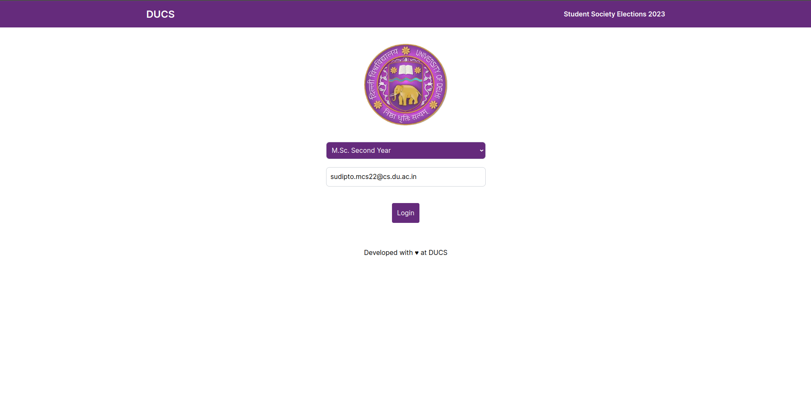
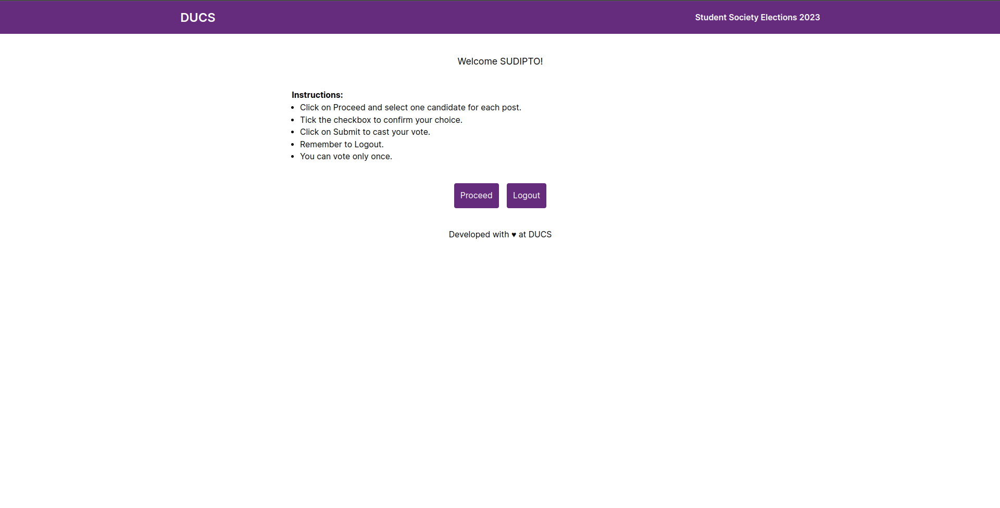
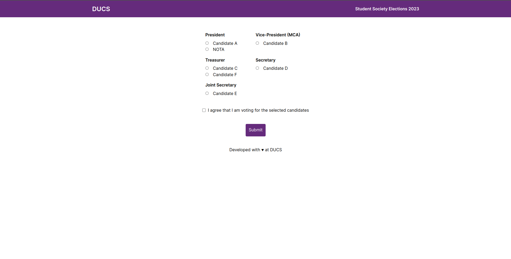
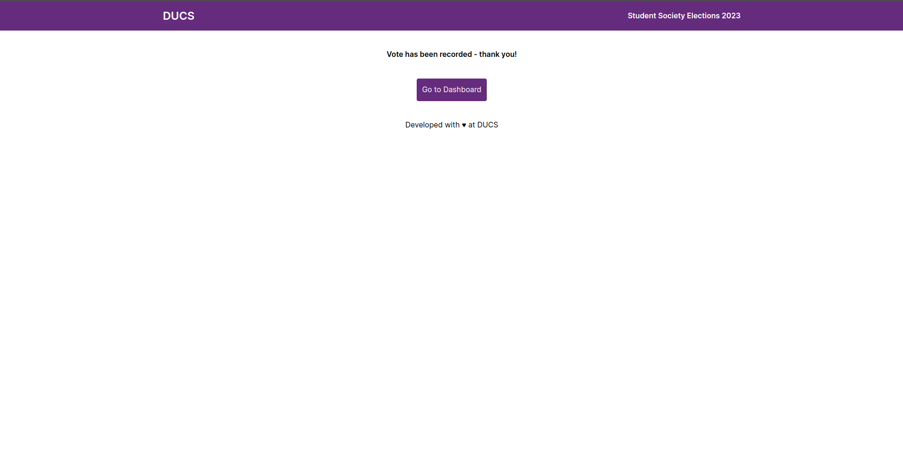
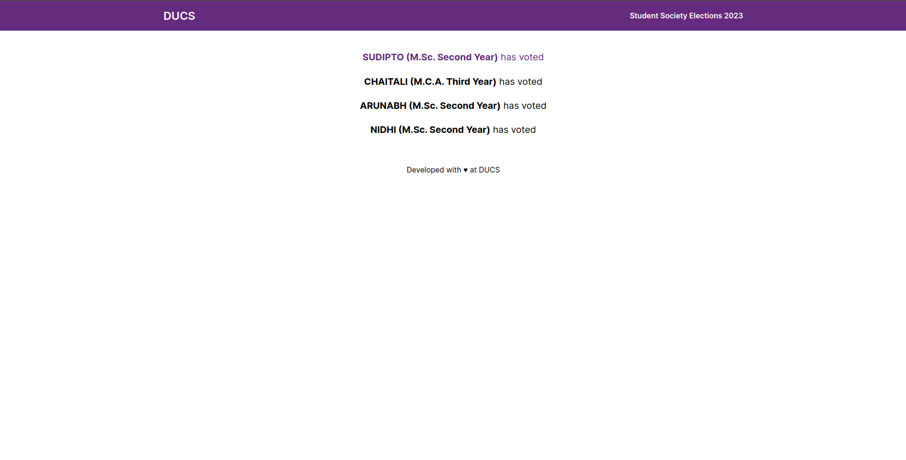
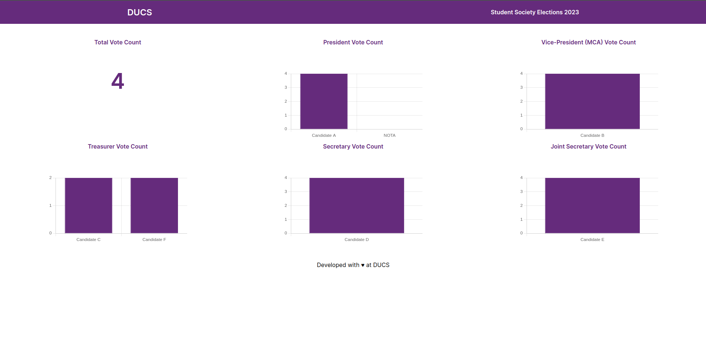

This repository contains the source code for the voting system used for DUCSS Elections 2023. It was built on top of Next.js and uses Prisma as an ORM for the database. The databases used were PostgreSQL for deployed instances and SQLite for offline instances.

## Features

- Authentication using a list of email addresses in database
- Voting for candidates running for various posts
- Visualization results of the election
- Visualization of list of students who have voted
- Support for multiple courses and sections
- TODO: Support for multiple elections

## Getting Started

### Prerequisites

- Node.js v20+
- Yarn Package Manager
- PostgreSQL / SQLite

### Setup

1. Clone the repository and navigate to the directory

```sh
$ git clone https://github.com/sudiptog81/ducs-voting-system
$ cd ducs-voting-system
```

2. Install dependencies

```sh
$ yarn install --include=dev
``````

3. Create a `.env` file in the root directory and add the following environment variables

```sh
DATABASE_URL="postgresql://<username>:<password>@<host>:<port>/<database>?schema=public" # For PostgreSQL
DATABASE_URL="file:./dev.db" # For SQLite

NEXT_PUBLIC_SECRET="...secret used for stats and list pages..."
NEXTAUTH_SECRET="...secret used for authentication..."
```

4. Run the migrations

```sh
$ yarn prisma migrate dev
```

5. Run the development server

```sh
$ yarn dev
```

### Deployment

1. Build the application

```sh
$ yarn build
```

2. Start the application

```sh
$ yarn start
```

### Deployment on Vercel

1. Create a new project on Vercel and link it to the GitHub repository

2. Add the following environment variables

```sh
DATABASE_URL="postgresql://<username>:<password>@<host>:<port>/<database>?schema=public" # For PostgreSQL

NEXT_PUBLIC_SECRET="...secret used for stats and list pages..."
NEXTAUTH_SECRET="...secret used for authentication..."
```

3. Redeploy the application on Vercel

## Screenshots








## License

Distributed under the MIT License. See `LICENSE.md` for more information.

## Author

[Sudipto Ghosh](https://ghosh.pro/links)<br />
Postgraduate Student<br />
Department of Computer Science<br />
Faculty of Mathematical Sciences<br />
University of Delhi
